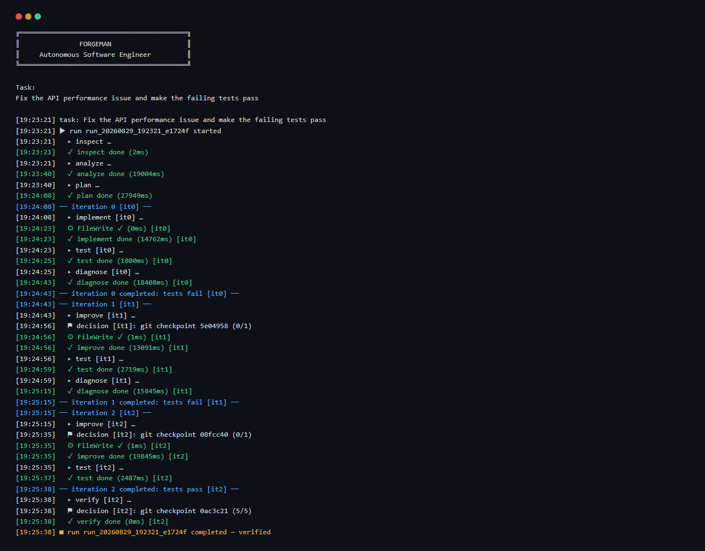
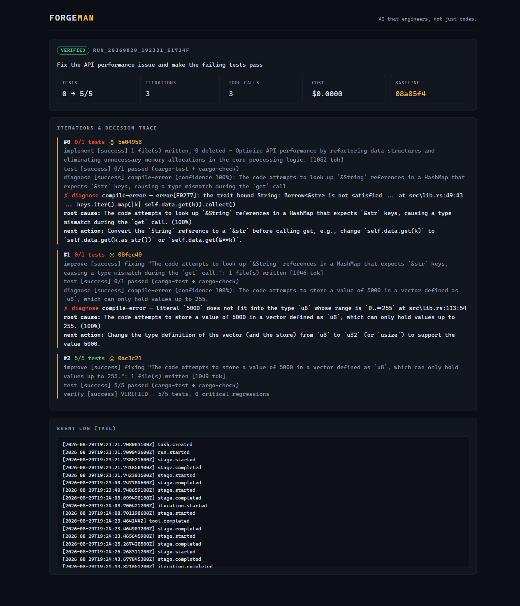
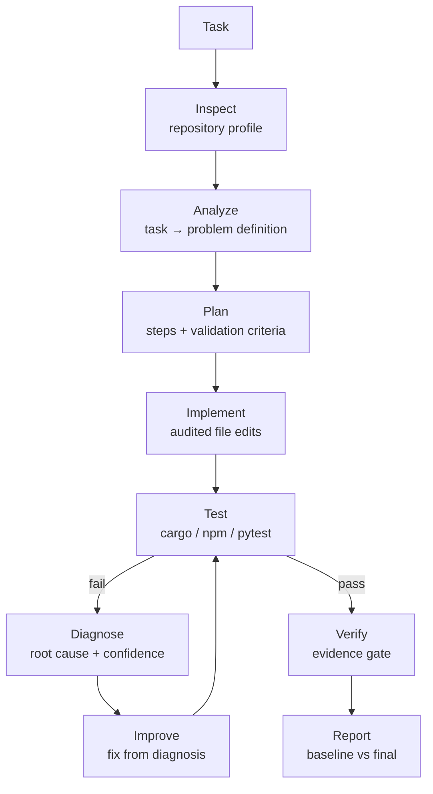

<div align="center">

# FORGEMAN

**Autonomous Software Engineering Agent**
*AI that engineers, not just codes.*

[](https://github.com/EndPx/forgeman/actions/workflows/ci.yml)


</div>

---

ForgeMan is a **closed-loop software engineering system**. It takes a real engineering problem, understands the repository, builds a plan, implements the change, runs the project's own test suite, **diagnoses its own failures**, iterates until the evidence says the problem is solved — and proves it with git checkpoints, a decision trace, and an engineering report.

> **Core principle:** code generated ≠ problem solved. `VERIFIED` is only claimed when tests prove it.

## Who has this problem?

Developers and small teams who already use AI coding assistants — and then
spend their evenings manually verifying what the assistant claimed to have
fixed. The bottleneck is not generating code; it is the **verification gap**:
the agent says "done", the tests still fail, and every fix means another round
of copy-pasting errors back into the chat. Unverified agent output is rework
waiting to happen, and nobody signs their name on a change nobody tested.

ForgeMan closes that gap: the loop runs autonomously, every claim is checked
against the repository's own test suite by an independent diagnoser, and the
result ships with evidence (checkpoints, decision trace, report) a human can
audit in minutes.

Scope note (ground rule 02): **the entire project — baseline included — was
built during this hackathon (August 29–30, 2026).** Nothing predates it.

## It in action

| Terminal (real run) | Dashboard (embedded) |
|---|---|
|  |  |

**What happened in that run** (100% real, on [`examples/flawed-api`](examples/flawed-api) — a repo with a deliberately broken build and two failing tests; run on the 5-test suite *before* the stricter round-3 performance gate was added):

| Metric | Result |
|---|---|
| Tests | **0 → 5/5 (+100%)** |
| Iterations | 3 (implement → improve → improve) |
| Git checkpoints | One per iteration, traceable with `forgeman diff` |
| Root causes found | 2 compile errors, diagnosed with 100% confidence + fix suggestions |
| LLM cost | **$0.00** (Z.AI glm-4.7-flash free tier) |

## Measured against a fair baseline

Same model, same task, same repositories, same test suites — the baseline is a
naive one-shot prompt with edits applied by a 30-line script
([`scripts/baseline.mjs`](scripts/baseline.mjs)):

| Case | Baseline (best of attempts) | ForgeMan (best of 2 runs) |
|---|---|---|
| `flawed-api` (Rust — broken build + 2 failing tests) | 2/5, never passed | **5/5 — VERIFIED** |
| `flawed-js` (Node — 1 failing test + O(n²)) | 2/3, never passed | exhausted ×2; round 2 sanity check preserved the tree (see below) |
| `flawed-py` (Python — 1 failing test + O(n²)) | 2/3, never passed | exhausted (no regression, no fix) |
| **Cases solved** | **0 / 3** | **1 / 3** |

ForgeMan wins the case that requires *diagnosis through cascading compile
errors*; it also fails honestly when the free-tier model goes off the rails —
and the failure is visible in the exit code, not hidden behind a confident
"done". When the worst failure mode (the model splitting code into a module it
never wrote) was observed, we added a **structural sanity check** that rejects
such edit sets with feedback before tests are spent — and round 2 confirmed
the catastrophic regression disappeared. Full protocol, raw data, round-2
results, and the challenging-case analysis:
**[docs/EVALUATION.md](docs/EVALUATION.md)** · evolution story:
**[docs/IMPROVEMENT_CHANGELOG.md](docs/IMPROVEMENT_CHANGELOG.md)** · agent
trajectories: **[docs/trajectories.md](docs/trajectories.md)**

## Quick start

```bash
# build everything (dashboard + release binary) — one command:
npm run build-all

# add your key (free at z.ai — each user brings their own)
cp .env.example .env        # set ZAI_API_KEY=...

# in ANY git repository with a test suite:
cd ~/projects/my-repo
forgeman init               # optional: scaffold .forgeman/config.toml
forgeman run "Fix the authentication bug"

# evidence:
forgeman report             # baseline → final, root causes, checkpoints
forgeman diff               # exactly what changed
forgeman dashboard          # live UI at http://127.0.0.1:3777
```

Full guide: [docs/GETTING_STARTED.md](docs/GETTING_STARTED.md) · Demo: `bash scripts/demo.sh`

## How it works



The loop runs until **all tests pass with no critical regressions** (`VERIFIED`), or a bound is hit: `max_iterations`, wall-clock timeout, or token budget. Stage failures retry up to 3 times, then escalate honestly — ForgeMan never claims success it cannot prove.

## Commands

| Command | Purpose |
|---|---|
| `forgeman run "task"` / `solve` | The full engineering loop |
| `forgeman inspect` | Repository intelligence profile |
| `forgeman analyze` / `plan "task"` | LLM analysis / plan standalone |
| `forgeman test` | Run the repo's validation suite |
| `forgeman report` / `diff` / `history` | Evidence and reporting |
| `forgeman dashboard` | Embedded web UI + live API |
| `forgeman init` | Scaffold configuration |

## Design guarantees

- **Independent evaluation** — the diagnoser judges only from evidence; `VERIFIED` requires the verify gate to re-assert passing tests.
- **Audited actions** — every file edit is path-confined to the repository and logged (`tool.started`/`tool.completed` + `ToolExecution` records).
- **Reproducible** — every run snapshots its config, streams JSONL events, and creates a git checkpoint per iteration.
- **Bounded by design** — iterations, retries, timeout, and cost are all capped. No infinite agent loops.
- **Pluggable LLM** — Z.AI (default, free tier), Anthropic, and OpenAI behind one `AgentProvider` trait; the core hardcodes no vendor.

## Configuration

```toml
[agent]
provider = "zai"          # zai | anthropic | openai
model = "glm-4.7-flash"

[execution]
max_iterations = 5
timeout_minutes = 20

[sandbox]
enabled = false           # true → Docker isolation (no network, 1 CPU, 1 GiB)

[budget]
max_cost_usd = 5.0
```

Credentials live in `.env` (gitignored): `ZAI_API_KEY`, optional `ANTHROPIC_API_KEY` / `OPENAI_API_KEY`.

## Repository map

```text
src/           CLI, core loop, providers, tools, sandbox, git, dashboard
agents/        inspect · analyze · plan · coder · test_runner · diagnose · improve · verify
web/           Next.js dashboard (exported and embedded into the binary)
examples/      flawed-api — the killer-demo repository
docs/          architecture, getting started
```

See [docs/architecture.md](docs/architecture.md) for the full design, or jump straight to [docs/GETTING_STARTED.md](docs/GETTING_STARTED.md).

## Hot take

The hard part of agentic software engineering is not generating code — it is
deciding what to do next when the evidence contradicts the agent's claims. Our
biggest reliability wins came from zero new model quality: feed the agent's own
failure analysis back into the next attempt (and let it persist across
iterations), and treat decode settings (`thinking: disabled`, token budgets) as
part of the output contract for structured edits. The model wrote the same bad
code in every naive attempt; **the loop, not the model, is what made it pass** —
and when the model is too weak, the loop still tells you the truth.

## License

[MIT](LICENSE)
